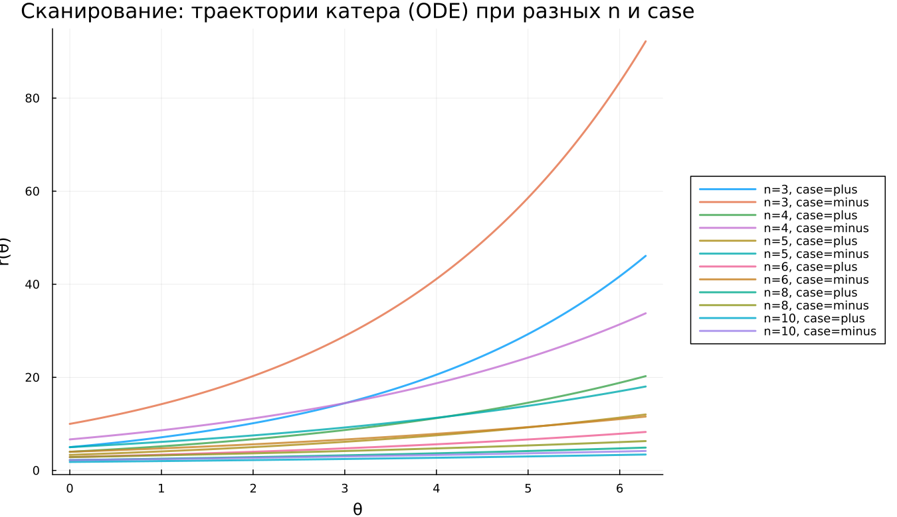

---
## Author
author:
  name: Абдуллахи Бахара
  email: 1032225714@rudn.ru
  affiliation:
    - name: Российский университет дружбы народов
      country: Российская Федерация
      postal-code: 117198
      city: Москва
      address: ул. Миклухо-Маклая, д. 6

## Title
title: "Математическое моделирование"
subtitle: "Лабораторная работа № 2"
license: "CC BY"
date: today
date-format: "YYYY-MM-DD"
---

# Введение

## Цель исследования

Построить математическую модель задачи преследования и определить стратегию движения, обеспечивающую гарантированный перехват цели.

Рассматриваемая ситуация: в условиях ограниченной видимости катер береговой охраны преследует лодку браконьеров. В момент кратковременного прояснения лодка фиксируется на расстоянии $k$ км. Затем она вновь исчезает и продолжает движение по прямой в неизвестном направлении.  

Скорость катера превышает скорость лодки в $n$ раз. Требуется определить форму траектории катера, при которой перехват неизбежен.

---

## Задачи работы

1. Вывести систему дифференциальных уравнений для случая $v_{\text{катер}} = n v_{\text{лодка}}$.
2. Смоделировать движение для двух вариантов начальных условий.
3. Определить точку пересечения траекторий по результатам численного эксперимента.

---

# Теоретическая часть

## Исходные обозначения

Положим $t_0 = 0$ — момент обнаружения.

В этот момент:

- лодка находится в начале координат: $r=0$,
- катер расположен на расстоянии $k$ от неё.

Используем полярную систему координат:

- полюс — точка обнаружения лодки,
- полярная ось направлена к начальному положению катера.

---

## Определение радиуса перехода

Пусть через время $t$ обе точки окажутся на одинаковом расстоянии $x$ от полюса.

Лодка проходит путь $x$, катер — $x-k$ либо $x+k$.

Из равенства времён движения получаем два случая:

### Режим case = plus
$$
x_1 = \frac{k}{n+1}, \quad \theta_0 = 0
$$

### Режим case = minus
$$
x_2 = \frac{k}{n-1}, \quad \theta_0 = -\pi
$$

---

## Разложение скорости катера

Модуль скорости катера равен $n v$.

Разложим её на составляющие:

- радиальная:
  $$
  v_r = \frac{dr}{dt}
  $$

- тангенциальная:
  $$
  v_t = r \frac{d\theta}{dt}
  $$

По теореме Пифагора:
$$
(nv)^2 = v_r^2 + v_t^2
$$

Так как $v_r = v$, получаем:
$$
v_t = v\sqrt{n^2-1}
$$

Следовательно,
$$
r\frac{d\theta}{dt} = v\sqrt{n^2-1}
$$

---

## Итоговая система ОДУ

$$
\begin{cases}
\frac{dr}{dt}=v \\
r\frac{d\theta}{dt}=v\sqrt{n^2-1}
\end{cases}
$$

Исключая параметр $t$, получаем:

$$
\frac{dr}{d\theta}=\frac{r}{\sqrt{n^2-1}}
$$

Решение данного уравнения описывает логарифмическую спираль.

---

# Численное моделирование

## Параметры расчёта

- $k = 20$ км,
- $n = 5$.

Необходимо построить траектории и определить точку перехвата.

---

# Результаты экспериментов

## Базовый режим: case = plus

### Наблюдения

- траектория катера — логарифмическая спираль;
- радиус возрастает монотонно;
- движение лодки в полярной системе представляется лучом.

---

## Базовый режим: case = minus

### Особенности

- начальный радиус больше;
- форма спирали сохраняется;
- изменяется только масштаб расположения траектории.

---

# Параметрическое исследование

## Влияние параметра $n$

Из уравнения
$$
\frac{dr}{d\theta}=\frac{r}{\sqrt{n^2-1}}
$$

следует:

- при малых $n$ коэффициент роста больше — спираль расширяется быстрее;
- при больших $n$ радиальный рост замедляется;
- траектория становится более пологой.

---

## Анализ метрики scale_ratio

Определим показатель:
$$
\text{scale\_ratio}=\frac{r_{\text{final}}}{\max(r_{\text{boat}})}
$$

### Интерпретация

- при малых $n$ значение существенно превышает 1;
- при увеличении $n$ показатель уменьшается;
- в режиме case = minus значения больше из-за увеличенного стартового радиуса.

---

## Время вычислений

### Вывод по производительности

- среднее время расчёта порядка $6\times10^{-4}$ сек;
- зависимость от $n$ практически отсутствует;
- колебания связаны с особенностями численного интегрирования.

---

# Заключение

## Основные выводы

1. Траектория катера имеет форму логарифмической спирали.
2. Параметр $n$ регулирует скорость радиального роста.
3. Начальная конфигурация влияет на масштаб, но не на тип кривой.
4. Численная схема устойчива и демонстрирует малые вычислительные затраты.

Модель адекватно описывает задачу преследования и согласуется с аналитическим выводом.
