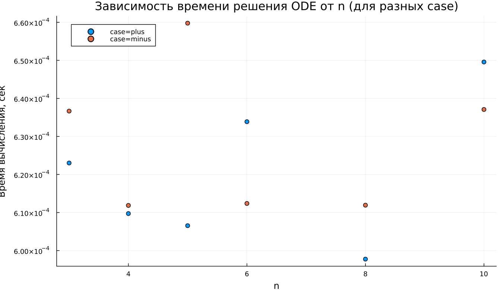

---
## Author
author:
  name: Абдуллахи Бахара
  email: 1032225714@rudn.ru
  affiliation:
    - name: Российский университет дружбы народов
      country: Российская Федерация
      postal-code: 117198
      city: Москва
      address: ул. Миклухо-Маклая, д. 6

## Title
title: "Математическое моделирование"
subtitle: "Лабораторная работа № 2"
license: "CC BY"
---

# Цель работы

Рассмотреть процесс построения математической модели, предназначенной для выбора рациональной стратегии в задаче преследования.  

В качестве примера анализируется следующая ситуация. В условиях тумана катер береговой охраны преследует лодку браконьеров. В определённый момент видимость восстанавливается, и лодка обнаруживается на расстоянии $k$ км от катера. Затем она вновь исчезает в тумане и продолжает движение по прямой в неизвестном направлении.  

Известно, что скорость катера превышает скорость лодки в $n$ раз. Требуется определить траекторию движения катера, обеспечивающую перехват.

# Задание

1. Выполнить аналитический вывод дифференциальных уравнений при условии, что скорость катера в $n$ раз больше скорости лодки.
2. Построить траектории движения катера и лодки для двух различных начальных конфигураций.
3. Определить по графику точку их встречи.

# Выполнение лабораторной работы

Положим $t_0 = 0$.  
Примем начало координат в точке обнаружения лодки: $x_0 = 0$.  
В момент обнаружения катер расположен на расстоянии $k$ от лодки.

Перейдём к полярной системе координат.  
Полюс совпадает с точкой обнаружения лодки, а полярная ось направлена в сторону начального положения катера.

Обозначим через $x$ расстояние от полюса, на котором катер и лодка окажутся одновременно. За время $t$ лодка пройдёт путь $x$, а катер — $x - k$ (или $x + k$ в зависимости от конфигурации).

Так как время движения одинаково, получаем равенства:

- первый случай:  
  $$
  \frac{x}{\upsilon} = \frac{x + k}{n\upsilon}
  $$

- второй случай:  
  $$
  \frac{x}{\upsilon} = \frac{x - k}{n\upsilon}
  $$

Решая данные уравнения, получаем начальные радиусы:

$$
x_1 = \frac{k}{n + 1}, \quad \theta_0 = 0
$$

$$
x_2 = \frac{k}{n - 1}, \quad \theta_0 = -\pi
$$

После достижения одинакового радиуса катер должен изменить стратегию движения и начать описывать траекторию вокруг полюса, удаляясь от него с той же радиальной скоростью, что и лодка.

Разложим скорость катера на составляющие:

- радиальная скорость:
  $$
  \upsilon_r = \frac{dr}{dt}
  $$

- тангенциальная скорость:
  $$
  \upsilon_t = r\frac{d\theta}{dt}
  $$

Поскольку модуль скорости катера равен $n\upsilon$, по теореме Пифагора:

$$
(n\upsilon)^2 = \upsilon_r^2 + \upsilon_t^2
$$

Учитывая, что $\upsilon_r = \upsilon$, получаем:

$$
\upsilon_t = \upsilon \sqrt{n^2 - 1}
$$

Следовательно,

$$
r\frac{d\theta}{dt} = \upsilon \sqrt{n^2 - 1}
$$

Итоговая система уравнений имеет вид:

$$
\begin{cases}
\frac{dr}{dt} = \upsilon \\
r\frac{d\theta}{dt} = \upsilon\sqrt{n^2 - 1}
\end{cases}
$$

Начальные условия:

$$
\begin{cases}
\theta_0 = 0 \\
r_0 = \frac{k}{n + 1}
\end{cases}
$$

$$
\begin{cases}
\theta_0 = -\pi \\
r_0 = \frac{k}{n - 1}
\end{cases}
$$

Исключая параметр $t$, получаем дифференциальное уравнение:

$$
\frac{dr}{d\theta} = \frac{r}{\sqrt{n^2 - 1}}
$$

Решение данного уравнения определяет траекторию катера в полярных координатах.

---

## Условие задачи

Лодка обнаружена на расстоянии $20$ км от катера.  
Скорость катера превышает скорость лодки в $5$ раз, то есть $n = 5$.

Для численного моделирования использовались внешние программные модули:





---

## Анализ результатов моделирования

Численно исследовано решение уравнения

$$
\frac{dr}{d\theta} = \frac{r}{\sqrt{n^2 - 1}}
$$

и проведено сопоставление с траекторией лодки, выраженной аналитически.

---

## Базовые эксперименты

### 1. Случай (case = plus)

Траектория катера имеет форму логарифмической спирали. Радиус возрастает монотонно при увеличении угла $\theta$, причём зависимость носит экспоненциальный характер, поскольку производная пропорциональна самому $r$.

Движение лодки соответствует лучу, что отражает её прямолинейную траекторию.

### 2. Случай (case = minus)

Во втором варианте начальный радиус больше, поэтому спираль начинается дальше от центра. Характер роста остаётся тем же, изменяется только масштаб.

---

## Параметрическое исследование по $n$

Коэффициент роста равен:

$$
\frac{1}{\sqrt{n^2 - 1}}
$$

Следовательно:

- при малых $n$ спираль расширяется быстрее;
- при увеличении $n$ рост замедляется;
- траектория становится более пологой.

Наиболее интенсивный рост наблюдается при $n = 3$, минимальный — при $n = 10$.

---

## Анализ метрики scale_ratio

Введена величина

$$
\text{scale\_ratio} = \frac{r_{\text{final}}}{\max(r_{\text{boat}})}
$$

Она характеризует относительное превышение радиуса катера над радиусом лодки.

Наблюдается уменьшение показателя при росте $n$.  
Во втором режиме значения выше из-за большего начального радиуса.

---

## Время вычислений

Анализ производительности показал:

- время решения порядка $6 \times 10^{-4}$ с;
- зависимость от $n$ практически отсутствует;
- небольшие колебания вызваны численными особенностями метода интегрирования.

---

# Выводы

1. Траектория катера описывается логарифмической спиралью.
2. Параметр $n$ определяет интенсивность радиального роста.
3. Начальные условия влияют на масштаб, но не на форму траектории.
4. Численная реализация демонстрирует устойчивость и малые вычислительные затраты.

Результаты согласуются с аналитическим решением полученного дифференциального уравнения.

# Список литературы {.unnumbered}

1. [Задача о погоне](https://esystem.rudn.ru/pluginfile.php/2290141/mod_resource/content/2/Лабораторная%20работа%20№%201.pdf)
