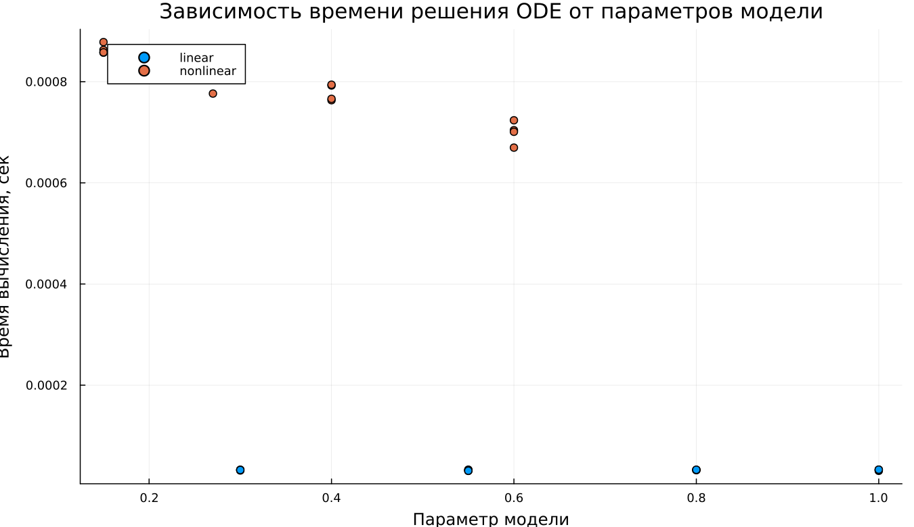

---
## Author
author:
  name: Абдуллахи Бахара
  email: 1032225714@rudn.ru
  affiliation:
    - name: Российский университет дружбы народов
      country: Российская Федерация
      postal-code: 117198
      city: Москва
      address: ул. Миклухо-Маклая, д. 6

## Title
title: "Математическое моделирование"
subtitle: "Лабораторная работа № 3"
license: "CC BY"
date: today
date-format: "YYYY-MM-DD"
---

# Вводная часть

## Цель работы

Рассмотреть модели боевых действий Ланчестера и исследовать динамику изменения численности войск в различных сценариях противоборства.

## Задание

1. Изучить три случая модели Ланчестера.
2. Построить графики изменения численности войск.
3. Определить характер динамики и победившую сторону.

# Теория: модели боевых действий

## Общая идея моделей Ланчестера

В противоборстве участвуют две стороны с численностями:

$$
x(t), \quad y(t)
$$

Если в некоторый момент времени численность одной из сторон обращается в нуль, то эта сторона считается проигравшей.

## Случай 1: регулярные войска против регулярных войск

Модель имеет вид:

$$
\begin{cases}
\frac{dx}{dt}= -a(t)x(t) - b(t)y(t) + P(t) \\
\frac{dy}{dt}= -c(t)x(t) - h(t)y(t) + Q(t)
\end{cases}
$$

Здесь учитываются:

- естественные потери;
- потери в бою;
- поступление подкрепления.

## Случай 2: регулярные войска против партизан

В этом случае потери партизан зависят и от численности армии, и от собственной численности:

$$
\begin{cases}
\frac{dx}{dt}= -a(t)x(t) - b(t)y(t) + P(t) \\
\frac{dy}{dt}= -c(t)x(t)y(t) - h(t)y(t) + Q(t)
\end{cases}
$$

## Случай 3: партизаны против партизан

Модель принимает вид:

$$
\begin{cases}
\frac{dx}{dt}= -a(t)x(t) - b(t)x(t)y(t) + P(t) \\
\frac{dy}{dt}= -h(t)y(t) - c(t)x(t)y(t) + Q(t)
\end{cases}
$$

# Упрощённые модели

## Жесткая модель для регулярных армий

При отсутствии подкрепления и небоевых потерь получаем:

$$
\begin{cases}
\frac{dx}{dt}= -by \\
\frac{dy}{dt}= -ax
\end{cases}
$$

Для этой модели существует точное решение, а траектории описываются гиперболами.

## Качественный вывод

Победа зависит не только от начальной численности армий, но и от эффективности вооружения.

Из анализа модели следует:

- более многочисленный противник имеет серьёзное преимущество;
- для компенсации численного превосходства требуется существенно более высокая боевая эффективность.

# Постановка задачи

## Исходные данные

Между страной $X$ и страной $Y$ идёт война.

Начальные численности армий:

$$
x(0)=32888, \qquad y(0)=17777
$$

Требуется построить графики изменения численности войск для двух случаев.

## Случай 1: линейная модель

$$
\begin{cases}
\frac{dx}{dt}= -0.55x(t) - 0.77y(t) + 1.5\sin(3t+1) \\
\frac{dy}{dt}= -0.66x(t) - 0.44y(t) + 1.2\cos(t+1)
\end{cases}
$$

## Случай 2: нелинейная модель

$$
\begin{cases}
\frac{dx}{dt}= -0.27x(t) - 0.88y(t) + \sin(20t) \\
\frac{dy}{dt}= -0.68x(t)y(t) - 0.37y(t) + \cos(10t)
\end{cases}
$$

# Эксперимент: базовые расчёты

## Базовый эксперимент: линейная модель

## Базовый эксперимент: линейная модель

Наблюдения:

- обе переменные убывают со временем;
- функция $x(t)$ уменьшается плавно;
- функция $y(t)$ убывает быстрее и к концу интервала почти достигает нуля;
- поведение системы устойчивое и предсказуемое.

## Базовый эксперимент: нелинейная модель

## Базовый эксперимент: нелинейная модель

Наблюдения:

- $x(t)$ убывает медленнее, чем в линейном случае;
- $y(t)$ практически мгновенно падает к нулю;
- после этого динамика системы определяется в основном переменной $x(t)$;
- нелинейные члены существенно усиливают затухание.

# Параметрический анализ

## Сканирование траекторий $x(t)$

## Сканирование траекторий $x(t)$

В ходе исследования изменялся параметр модели.

Основные результаты:

- при увеличении параметра скорость убывания $x(t)$ возрастает;
- траектории становятся более крутыми;
- различия особенно заметны в середине и конце интервала интегрирования.

## Сканирование траекторий $y(t)$

## Сканирование траекторий $y(t)$

Наблюдения:

- в линейной модели увеличение параметра ускоряет спад $y(t)$;
- в нелинейной модели $y(t)$ быстро обращается в нуль почти независимо от параметра;
- влияние нелинейных членов оказывается доминирующим.

# Анализ вычислительных затрат

## Время вычислений

## Время вычислений

Результаты:

- линейная модель вычисляется быстрее;
- время расчёта линейной системы имеет порядок $10^{-5}$ сек;
- для нелинейной модели время порядка $10^{-4}$–$10^{-3}$ сек;
- даже в нелинейном случае вычислительные затраты малы.

# Анализ итоговой метрики

## Метрика norm_final

Рассматривалась итоговая характеристика:

$$
\text{norm\_final}=\sqrt{x(t_{final})^2 + y(t_{final})^2}
$$

Она описывает величину состояния системы в конце моделирования.

## Зависимость norm_final от параметра

## Интерпретация результата

Из графика видно:

- при увеличении параметра метрика уменьшается;
- линейная модель быстрее стремится к состоянию покоя;
- нелинейная модель дольше сохраняет заметное значение состояния;
- основная причина — более медленное затухание переменной $x(t)$.

# Итоги

## Выводы

1. Линейная модель демонстрирует плавное и предсказуемое убывание обеих переменных.
2. В нелинейной модели переменная $y(t)$ практически мгновенно обращается в нуль.
3. Параметры существенно влияют на скорость затухания решений.
4. В линейной системе это влияние выражено сильнее и нагляднее.
5. Нелинейная модель требует больше вычислительных ресурсов, но остаётся вычислительно дешёвой.
6. Метрика $\text{norm\_final}$ уменьшается с ростом параметра, что подтверждает усиление затухания динамики.

# Список литературы

1. Законы Осипова — Ланчестера.
2. Дифференциальные уравнения динамики боя.
3. Элементарные модели боя.
