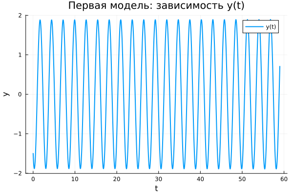
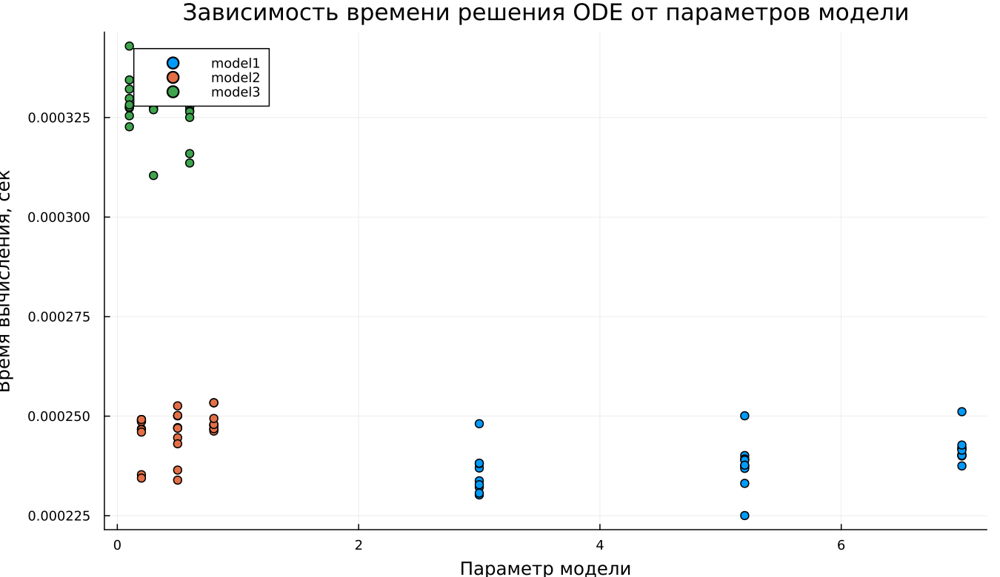

---
## Author
author:
  name: Абдуллахи Бахара
  email: 1032225714@rudn.ru
  affiliation:
    - name: Российский университет дружбы народов
      country: Российская Федерация
      postal-code: 117198
      city: Москва
      address: ул. Миклухо-Маклая, д. 6

## Title
title: "Математическое моделирование"
subtitle: "Лабораторная работа № 4"
license: "CC BY"
date: today
date-format: "YYYY-MM-DD"
---

# Вводная часть

## Цель работы

Проанализировать поведение гармонического осциллятора при различных условиях функционирования:

1. в отсутствии затухания;
2. при наличии затухания;
3. при действии затухания и внешнего воздействия.

## Задание

1. Получить и визуализировать решение модели без затухания.
2. Сформулировать уравнение затухающего осциллятора и исследовать его решение.
3. Построить фазовый портрет для случая с затуханием.
4. Записать модель с внешним воздействием.
5. Исследовать решение и фазовую динамику вынужденных колебаний.

# Теоретические сведения

## Гармонический осциллятор

Линейный гармонический осциллятор является базовой моделью, описывающей множество колебательных процессов в различных областях науки и техники.

Обобщённая форма уравнения:

$$
\ddot{x} + 2\gamma \dot{x} + \omega_0^2 x = F(t)
$$

где:

- $x$ — переменная состояния;
- $\gamma$ — коэффициент диссипации;
- $\omega_0$ — собственная частота системы;
- $F(t)$ — внешнее воздействие.

## Осциллятор без затухания

При отсутствии потерь энергии уравнение упрощается:

$$
\ddot{x} + \omega_0^2 x = 0
$$

Такая система сохраняет энергию, а её движение остаётся строго периодическим.

## Осциллятор с затуханием

Если учитывать диссипацию энергии, модель принимает вид:

$$
\ddot{x} + 2\gamma \dot{x} + \omega_0^2 x = 0
$$

В этом случае амплитуда колебаний постепенно уменьшается, и система со временем приходит к равновесию.

## Осциллятор с внешней силой

При наличии внешнего воздействия уравнение записывается следующим образом:

$$
\ddot{x} + 2\gamma \dot{x} + \omega_0^2 x = F(t)
$$

Внешняя сила компенсирует потери энергии и формирует вынужденные колебания.

# Переход к системе первого порядка

## Без затухания

$$
\begin{cases}
\dot{x} = y \\
\dot{y} = -\omega_0^2 x
\end{cases}
$$

## С затуханием

$$
\begin{cases}
\dot{x} = y \\
\dot{y} = -2\gamma y - \omega_0^2 x
\end{cases}
$$

## С внешней силой

$$
\begin{cases}
\dot{x} = y \\
\dot{y} = F(t) - 2\gamma y - \omega_0^2 x
\end{cases}
$$

## Начальные условия

Во всех экспериментах использовались одинаковые начальные данные:

$$
x_0 = 0.5, \qquad y_0 = -1.5
$$

Временной интервал моделирования:

$$
t \in [0;59]
$$

Шаг численного интегрирования:

$$
h = 0.05
$$

# Постановка задачи

## Модель 1: без затухания и внешней силы

$$
\ddot{x} + 5.2x = 0
$$

## Модель 2: с затуханием без внешнего воздействия

$$
\ddot{x} + 14\dot{x} + 0.5x = 0
$$

## Модель 3: с затуханием и внешним воздействием

$$
\ddot{x} + 13\dot{x} + 0.3x = 0.8\sin(9t)
$$

# Базовые эксперименты

## Первая модель: решение

## Первая модель: фазовый портрет

## Первая модель: анализ

Первая модель демонстрирует классическое поведение консервативной системы.

Наблюдаемые характеристики:

- амплитуда колебаний практически не изменяется;
- движение остаётся строго периодическим;
- энергия не рассеивается;
- фазовая траектория имеет замкнутую форму.

Таким образом, система реализует идеализированные собственные колебания без потерь.

## Вторая модель: решение

## Вторая модель: фазовый портрет

## Вторая модель: анализ

Во второй модели проявляется выраженное затухание.

Основные наблюдения:

- переменная быстро стремится к нулевому значению;
- переходный процесс протекает за короткое время;
- фазовая траектория сжимается к точке равновесия;
- система стабилизируется.

Следовательно, реализуется режим апериодического затухания.

## Третья модель: решение

## Третья модель: фазовый портрет

## Третья модель: анализ

В третьем случае одновременно действуют затухание и внешняя сила.

Результаты анализа:

- после переходного этапа формируются устойчивые малые колебания;
- решение не обнуляется полностью;
- внешнее воздействие поддерживает движение;
- фазовая траектория ограничена компактной областью.

Это соответствует режиму установившихся вынужденных колебаний.

# Параметрическое исследование

## Сканирование траекторий $x(t)$

## Анализ траекторий $x(t)$

Проведён сравнительный анализ поведения системы при варьировании параметров.

Выявленные зависимости:

- в первой модели параметры определяют частоту колебаний;
- во второй — влияют на интенсивность затухания;
- в третьей — изменяют характеристики установившегося режима.

## Сканирование траекторий $y(t)$

## Анализ траекторий $y(t)$

Для переменной $y(t)$ наблюдаются сходные тенденции:

- первая модель сохраняет устойчивую периодичность;
- вторая быстро стремится к равновесию;
- третья демонстрирует устойчивые вынужденные колебания малой амплитуды.

# Анализ вычислений

## Время вычислений

## Интерпретация времени вычислений

Анализ производительности показал:

- первая модель вычисляется наиболее быстро;
- вторая требует несколько больше ресурсов;
- третья является наиболее затратной из-за внешнего воздействия.

При этом во всех случаях вычислительная нагрузка остаётся незначительной.

# Анализ итоговой метрики

## Метрика norm_final

Использовалась величина:

$$
\text{norm\_final} = \sqrt{x(t_{final})^2 + y(t_{final})^2}
$$

Она отражает состояние системы в конечный момент времени.

## Зависимость norm_final от параметра

## Интерпретация результата

Анализ показывает:

- в первой модели значение остаётся конечным вследствие отсутствия затухания;
- во второй модели метрика стремится к нулю;
- в третьей модели значение мало, но не исчезает полностью.

Таким образом, метрика корректно отражает различия в динамике систем.

# Итоги

## Выводы

1. Первая модель описывает устойчивые периодические колебания без потерь энергии.
2. Вторая модель характеризуется быстрым затуханием и переходом к равновесию.
3. Третья модель выходит на стационарный режим вынужденных колебаний.
4. Параметры существенно влияют на частоту, затухание и амплитуду.
5. Все рассмотренные модели эффективно решаются численно.
6. Метрика $\text{norm\_final}$ подтверждает различия в поведении систем.
