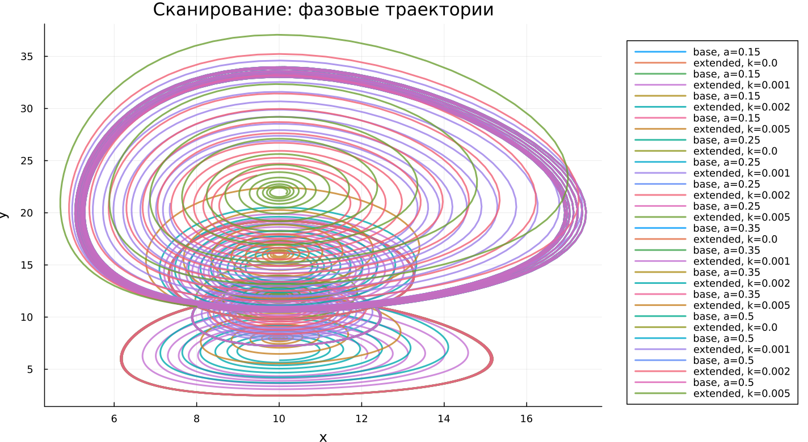

---
## Author
author:
  name: Абдуллахи Бахара
  email: 1032225714@rudn.ru
  affiliation:
    - name: Российский университет дружбы народов
      country: Российская Федерация
      postal-code: 117198
      city: Москва
      address: ул. Миклухо-Маклая, д. 6

## Title
title: "Математическое моделирование"
subtitle: "Лабораторная работа № 5"
license: "CC BY"
---

# Цель работы

Исследовать математическую модель взаимодействия популяций типа «хищник–жертва».

# Задание

1. Построить фазовый график зависимости $x$ от $y$, а также временные зависимости $x(t)$ и $y(t)$  
2. Определить стационарное состояние системы  

# Выполнение лабораторной работы

## Теоретические сведения

В рамках данной работы анализируется классическая модель взаимодействия популяций «хищник–жертва».

Рассмотрим систему, в которой присутствуют две популяции: $X$ — хищники и $Y$ — жертвы. Предполагается выполнение следующих условий (модель Лотки–Вольтерры):

1. Численности популяций зависят исключительно от времени, пространственные эффекты не учитываются  
2. При отсутствии взаимодействия каждая популяция развивается по экспоненциальному закону: жертвы увеличиваются, хищники уменьшаются  
3. Естественные процессы смертности жертв и рождаемости хищников считаются пренебрежимо малыми  
4. Ограничения на рост популяций (эффект насыщения) отсутствуют  
5. Влияние взаимодействия выражается через уменьшение темпа роста жертв пропорционально численности хищников  

Математическая модель имеет вид:

$$
\begin{cases}
\frac{dx}{dt} = -a x(t) + b x(t) y(t) \\
\frac{dy}{dt} = c y(t) - d x(t) y(t)
\end{cases}
$$

Здесь коэффициенты имеют следующий смысл:  
$a$ — коэффициент убыли хищников,  
$b$ — коэффициент их прироста за счёт взаимодействия,  
$c$ — коэффициент роста жертв,  
$d$ — коэффициент их гибели при взаимодействии.

Система допускает особое состояние, при котором динамика прекращается. Это стационарное состояние, характеризующееся условиями:

$$
\frac{dx}{dt} = 0, \quad \frac{dy}{dt} = 0
$$

При положительных значениях численностей ($x>0, y>0$) стационарная точка определяется формулами:

$$
x_0 = \frac{c}{d}, \quad y_0 = \frac{a}{b}
$$

## Задача

Рассмотрим конкретную систему:

$$
\begin{cases}
\frac{dx}{dt} = -0.25 x(t) + 0.025 x(t) y(t) \\
\frac{dy}{dt} = 0.45 y(t) - 0.045 x(t) y(t)
\end{cases}
$$

Требуется:

- построить фазовую траекторию $x(y)$ и графики $x(t)$, $y(t)$  
- провести моделирование при начальных условиях $x_0 = 8$, $y_0 = 11$  
- определить стационарное состояние  

Стационарная точка системы:

$$
x_0 = \frac{c}{d} = 10, \quad y_0 = \frac{a}{b} = 10
$$

Для численного решения и визуализации использовались внешние программные модули:





## Базовые эксперименты

### Базовая модель (model_type = base)

Анализ временных зависимостей показывает наличие устойчивых колебаний. Значения $x(t)$ и $y(t)$ изменяются периодически, причём амплитуда практически не уменьшается со временем.

Такое поведение указывает на сохранение энергии системы и отсутствие затухания. Популяции продолжают совершать циклические изменения, не переходя к равновесию.

Фазовый портрет представляет собой замкнутую траекторию, что подтверждает периодичность процесса и ограниченность динамики.

### Расширенная модель (model_type = extended)

В расширенной постановке также наблюдаются колебания, однако их характер меняется. Амплитуда сначала значительная, но со временем уменьшается.

Причиной является дополнительный нелинейный член $-k x^2$, ограничивающий рост жертв. Это приводит к потере консервативности и появлению затухающего режима.

Фазовая траектория имеет спиралевидную форму и постепенно стремится к точке равновесия, что свидетельствует о наличии устойчивого стационарного состояния.

Таким образом, добавление нелинейного ограничения стабилизирует динамику системы.

## Параметрическое сканирование

### Траектории $x(t)$ для различных параметров

Проведён анализ влияния параметров на поведение моделей. В базовом варианте изменялся коэффициент $a$, в расширенном — параметр $k$.

В базовой модели изменение $a$ влияет на частоту и амплитуду колебаний, однако система остаётся периодической.

В расширенной модели параметр $k$ определяет интенсивность затухания. При увеличении его значения колебания быстрее подавляются, и система быстрее выходит на стационарный режим.

Основные выводы:

- базовая модель сохраняет колебательный характер  
- расширенная демонстрирует затухание  
- параметры регулируют форму и скорость динамики  

### Траектории $y(t)$ для различных параметров

Аналогичные результаты наблюдаются и для $y(t)$. В базовой системе сохраняется периодичность, тогда как в расширенной — происходит постепенное установление равновесия.

Увеличение параметра $k$ ускоряет стабилизацию системы.

### Фазовые траектории для различных параметров

Фазовые портреты демонстрируют принципиальные различия:

- для базовой модели — замкнутые кривые  
- для расширенной — спирали, сходящиеся к центру  

Это подтверждает различие в типах динамики: автоколебательный режим против стабилизирующегося.

## Анализ метрики norm_final

Использовалась метрика:

$$
\text{norm\_final} = \sqrt{x(t_{final})^2 + y(t_{final})^2}
$$

В базовой модели значение метрики остаётся значительным, так как система продолжает колебаться.

В расширенной модели величина определяется положением устойчивого состояния, к которому система стремится после затухания.

## Время вычислений

Анализ производительности показал, что вычислительные затраты остаются малыми для всех экспериментов.

Изменение параметров $a$ и $k$ не оказывает существенного влияния на время расчёта. Даже при усложнении модели вычислительная эффективность сохраняется.

## Выводы

1. Базовая модель демонстрирует устойчивые периодические колебания без затухания  
2. Расширенная модель приводит к затухающим колебаниям и выходу на равновесие  
3. Фазовые портреты отражают различие динамических режимов  
4. Параметры $a$ и $k$ управляют характеристиками колебаний  
5. Метрика $\text{norm\_final}$ позволяет различить тип поведения системы  
6. Численное моделирование выполняется эффективно для обеих моделей  

# Список литературы {.unnumbered}

1. [Модель Лотки-Вольтерры](https://math-it.petrsu.ru/users/semenova/MathECO/Lections/Lotka_Volterra.pdf)
2. [Lotka-Volterra System](https://www.sciencedirect.com/topics/mathematics/lotka-volterra-system)
