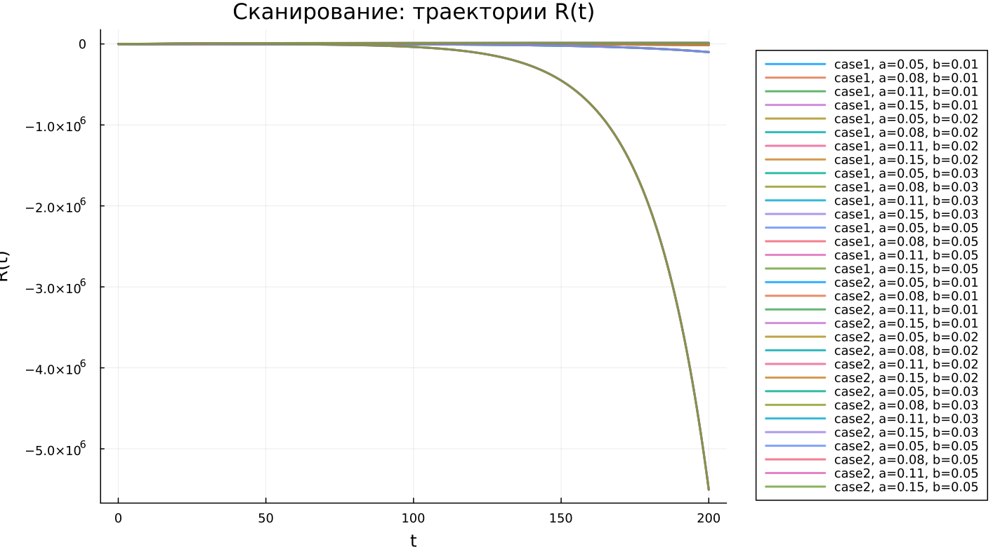

---
author:
  name: Абдуллахи Бахара
  email: 1032225714@rudn.ru
  affiliation:
    - name: Российский университет дружбы народов
      country: Российская Федерация
      city: Москва
title: "Математическое моделирование"
subtitle: "Лабораторная работа № 6"
license: "CC BY"
date: today
date-format: "YYYY-MM-DD"
---

# Вводная часть

## Цель работы

Исследовать эпидемиологическую модель $SIR$ и проанализировать характер распространения заболевания в популяции.

## Задание

1. Рассмотреть математическую модель эпидемии.
2. Построить графики изменения численности групп $S(t)$, $I(t)$ и $R(t)$.
3. Изучить два режима развития процесса:
   - $I(0) \leq I^*$;
   - $I(0) > I^*$.
4. Провести параметрическое исследование модели.
5. Сравнить полученные результаты для разных вариантов системы.

# Теоретические сведения

## Модель SIR

В модели $SIR$ всё население делится на три группы:

- $S(t)$ — восприимчивые к заболеванию;
- $I(t)$ — инфицированные и распространяющие болезнь;
- $R(t)$ — выздоровевшие, обладающие иммунитетом.

Полная численность популяции задаётся выражением:

$$
N = S(t) + I(t) + R(t).
$$

## Основная идея модели

Модель описывает последовательный переход особей между группами:

$$
S \rightarrow I \rightarrow R.
$$

Сначала восприимчивые особи заражаются и переходят в группу инфицированных. Затем инфицированные выздоравливают и переходят в группу $R$.

## Условие изоляции

До тех пор пока число инфицированных не превышает критический уровень $I^*$, считаем, что больные изолированы и не заражают здоровых.

Если выполняется условие:

$$
I(t) \leq I^*,
$$

то новые заражения отсутствуют.

Если же:

$$
I(t) > I^*,
$$

то инфекция начинает распространяться среди восприимчивых особей.

## Уравнение для $S(t)$

Изменение числа восприимчивых описывается следующим образом:

$$
\frac{dS}{dt} =
\begin{cases}
-\alpha S, & I(t) > I^*, \\
0, & I(t) \leq I^*.
\end{cases}
$$

## Уравнение для $I(t)$

Динамика числа инфицированных задаётся уравнением:

$$
\frac{dI}{dt} =
\begin{cases}
\alpha S - \beta I, & I(t) > I^*, \\
-\beta I, & I(t) \leq I^*.
\end{cases}
$$

## Уравнение для $R(t)$

Число выздоровевших изменяется по закону:

$$
\frac{dR}{dt} = \beta I.
$$

Параметры системы имеют следующий смысл:

- $\alpha$ — коэффициент заражения;
- $\beta$ — коэффициент выздоровления.

# Постановка задачи

## Исходные данные

Рассматривается эпидемия, возникшая на острове.

Известны следующие значения:

$$
N = 11400,
$$

$$
I(0) = 250,
$$

$$
R(0) = 47.
$$

## Начальное число восприимчивых

Количество восприимчивых особей в начальный момент времени находится по формуле:

$$
S(0) = N - I(0) - R(0).
$$

После подстановки исходных данных получаем:

$$
S(0) = 11400 - 250 - 47 = 11103.
$$

## Рассматриваемые случаи

В работе анализируются два варианта развития эпидемии:

1. $I(0) \leq I^*$ — начальное число инфицированных не превышает критический порог.
2. $I(0) > I^*$ — начальное число инфицированных больше критического значения.

# Базовые эксперименты

## Первая модель: временные зависимости

## Первая модель: фазовый портрет

## Анализ первой модели

В первой модели наблюдается поведение, нехарактерное для стандартной эпидемиологической системы:

- $S(t)$ не изменяется во времени;
- $I(t)$ растёт по экспоненциальному закону;
- $R(t)$ уменьшается и может принимать отрицательные значения;
- в системе отсутствует механизм ограничения роста инфицированных.

## Вывод по первой модели

Первая модель плохо согласуется с физическим смыслом классической $SIR$-системы.

Ключевая особенность этой модели:

$$
S(t) = const.
$$

Из-за этого число восприимчивых не сокращается, а количество инфицированных продолжает расти без естественного ограничения.

# Вторая модель

## Вторая модель: временные зависимости

## Вторая модель: фазовый портрет

## Анализ второй модели

Во второй модели проявляется типичная динамика эпидемического процесса:

- $S(t)$ постепенно уменьшается;
- $I(t)$ сначала возрастает;
- затем $I(t)$ достигает максимума;
- после прохождения пика число инфицированных снижается;
- $R(t)$ монотонно увеличивается.

## Интерпретация второй модели

В начале эпидемии заболевание активно распространяется среди восприимчивых особей.

Позже число восприимчивых уменьшается, интенсивность заражения падает, и эпидемический процесс постепенно затухает:

$$
I(t) \rightarrow 0.
$$

# Сравнение базовых моделей

## Качественное различие

| Характеристика | Первая модель | Вторая модель |
|---|---|---|
| $S(t)$ | остаётся постоянным | убывает |
| $I(t)$ | растёт без ограничения | достигает конечного максимума |
| $R(t)$ | может становиться отрицательным | монотонно возрастает |
| Фазовый портрет | вертикальная траектория | незамкнутая кривая |
| Физический смысл | нарушается | сохраняется |

# Параметрическое исследование

## Сканирование траекторий $S(t)$

## Анализ траекторий $S(t)$

Для первой модели характерно следующее:

- $S(t)$ остаётся неизменным;
- изменение параметров практически не влияет на динамику восприимчивых.

Для второй модели наблюдается другая картина:

- $S(t)$ уменьшается;
- при увеличении параметра $a$ спад происходит быстрее.

## Сканирование траекторий $I(t)$

## Анализ траекторий $I(t)$

Первая модель показывает:

- экспоненциальный рост $I(t)$;
- ускорение роста при увеличении параметра $b$.

Вторая модель демонстрирует:

- формирование эпидемической волны;
- достижение максимума числа инфицированных;
- последующее уменьшение $I(t)$.

## Сканирование траекторий $R(t)$

## Анализ траекторий $R(t)$

В первой модели:

- $R(t)$ может принимать нефизичные значения;
- возможен переход в область отрицательных значений.

Во второй модели:

- $R(t)$ возрастает;
- число выздоровевших стремится к конечному уровню.

## Фазовые траектории

## Анализ фазовых траекторий

Фазовые портреты наглядно показывают различие между моделями:

- в первой модели траектории превращаются в вертикальные линии;
- во второй модели траектории имеют форму, характерную для $SIR$-динамики;
- сначала происходит рост $I$ при уменьшении $S$;
- затем начинается спад числа инфицированных.

# Анализ итоговых метрик

## Метрика norm_final

Для оценки конечного состояния системы использовалась метрика:

$$
\text{norm\_final} =
\sqrt{
S(t_{final})^2 +
I(t_{final})^2 +
R(t_{final})^2
}.
$$

Она позволяет количественно описать состояние модели в конце расчётного интервала.

## Зависимость norm_final от параметра

## Интерпретация norm_final

Для первой модели:

- значение метрики быстро увеличивается;
- основной причиной является экспоненциальный рост $I(t)$.

Для второй модели:

- значения метрики заметно меньше;
- система постепенно выходит к стационарному состоянию.

# Максимум инфицированных

## Зависимость $I_{max}$ от параметра

## Анализ $I_{max}$

Для первой модели:

- $I_{max}$ принимает очень большие значения;
- рост числа инфицированных ничем не ограничивается.

Для второй модели:

- максимум инфицированных остаётся конечным;
- величина пика зависит от параметра $a$;
- при большем $a$ максимум достигается быстрее.

# Анализ вычислений

## Время вычислений

## Интерпретация времени вычислений

Результаты бенчмаркинга показывают:

- обе модели численно решаются достаточно быстро;
- время вычислений имеет порядок $10^{-4}$ секунды;
- изменение параметров почти не влияет на вычислительную сложность;
- используемый численный метод работает устойчиво и эффективно.

# Итоги

## Основные результаты

1. Первая модель показывает нефизичную динамику.
2. В первой модели число инфицированных растёт без ограничения.
3. Вторая модель описывает реалистичную эпидемическую волну.
4. Во второй модели эпидемия постепенно затухает, а $I(t) \to 0$.
5. Фазовые портреты подтверждают качественное различие между моделями.

## Выводы

1. Модель case1 нельзя считать адекватной для описания распространения эпидемии.
2. Модель case2 соответствует классической логике $SIR$-процесса.
3. Параметры $a$ и $b$ существенно влияют на скорость и интенсивность распространения заболевания.
4. Метрики $\text{norm\_final}$ и $I_{max}$ позволяют количественно сравнить две модели.
5. Численное решение обеих систем выполняется эффективно и не требует больших вычислительных затрат.

# Список литературы {.unnumbered}

1. [Конструирование эпидемиологических моделей](https://habr.com/ru/post/551682/)
2. [Зараза, гостья наша](https://nplus1.ru/material/2019/12/26/epidemic-math)
