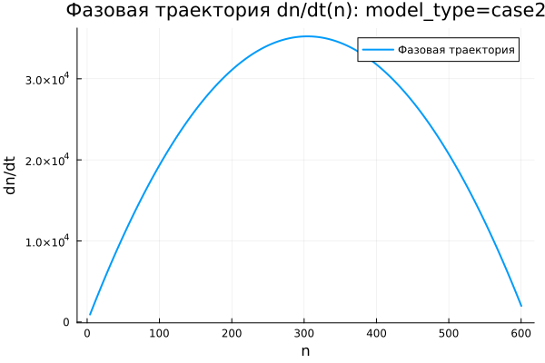
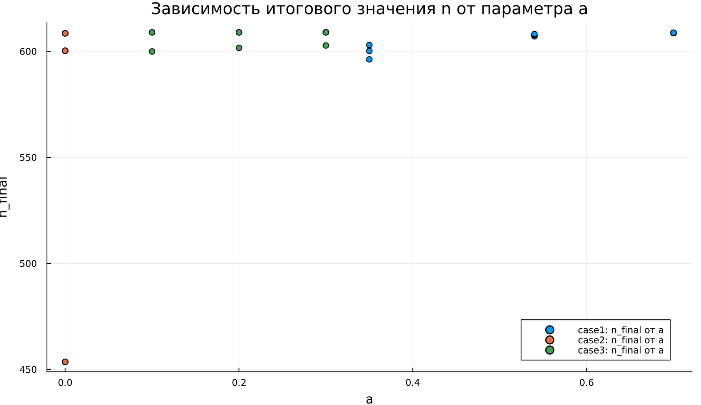
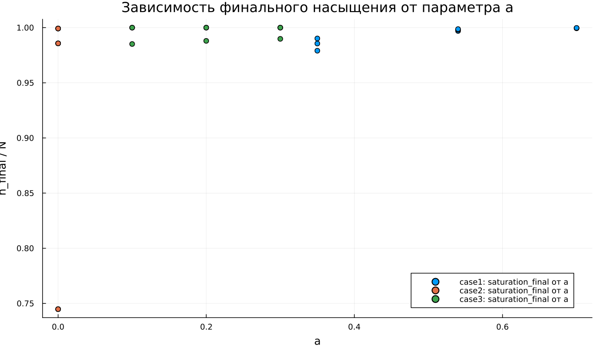
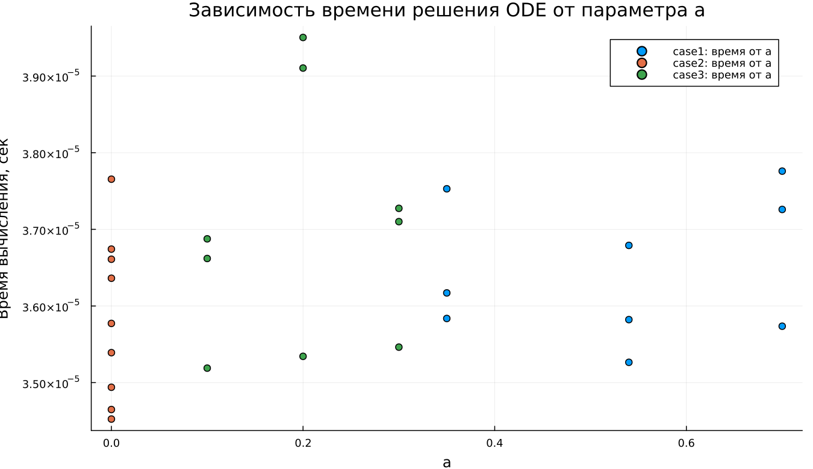

---
author:
  name: Абдуллахи Бахара
  email: 1032225714@rudn.ru
  affiliation:
    - name: Российский университет дружбы народов
      country: Российская Федерация
      city: Москва
title: "Математическое моделирование"
subtitle: "Лабораторная работа №7"
license: "CC BY"
date: today
date-format: "YYYY-MM-DD"
---

# Вводная часть

## Цель работы

Изучить модель эффективности рекламной кампании и проанализировать процесс распространения информации о товаре среди потенциальных покупателей.

## Задание

1. Рассмотреть математическую модель эффективности рекламы.
2. Построить графики распространения рекламы для трех заданных случаев.
3. Исследовать изменение скорости распространения информации.
4. Провести параметрическое исследование моделей.
5. Сравнить динамику трех вариантов рекламного процесса.

# Теоретические сведения

## Модель распространения рекламы

Введем основные обозначения:

- $N$ — общее число потенциальных покупателей;
- $n(t)$ — количество покупателей, осведомленных о товаре;
- $t$ — время, прошедшее с начала рекламной кампании;
- $\frac{dn}{dt}$ — скорость роста числа информированных покупателей.

## Основная идея модели

Информация о товаре распространяется по двум каналам:

1. Через прямое рекламное воздействие.
2. Через общение покупателей друг с другом.

Общая модель имеет вид:

$$
\frac{dn}{dt} =
(\alpha_1(t) + \alpha_2(t)n(t))(N - n(t)).
$$

## Смысл множителей

Множитель $(N - n(t))$ задает количество покупателей, которые еще не знают о товаре.

Когда $n(t)$ приближается к $N$, выполняется соотношение:

$$
N - n(t) \rightarrow 0.
$$

Поэтому скорость распространения информации постепенно снижается.

## Уровень насыщения

Величина $N$ задает предельный уровень охвата аудитории:

$$
n(t) \rightarrow N.
$$

При $n = N$ весь круг потенциальных покупателей уже осведомлен о товаре, поэтому дальнейший прирост прекращается.

# Постановка задачи

## Исходные данные

Дано:

$$
N = 609,
$$

$$
n(0) = 4.
$$

Требуется построить графики $n(t)$ для трех моделей распространения рекламы.

## Первая модель

$$
\frac{dn}{dt} =
(0.54 + 0.00016n(t))(N - n(t)).
$$

В первой модели прямое рекламное воздействие играет более заметную роль, чем передача информации между покупателями.

## Вторая модель

$$
\frac{dn}{dt} =
(0.000021 + 0.38n(t))(N - n(t)).
$$

Во второй модели основной вклад в рост дает обмен информацией между уже осведомленными и неосведомленными покупателями.

## Третья модель

$$
\frac{dn}{dt} =
(0.2\cos t + 0.2\cos 2t \cdot n(t))(N - n(t)).
$$

В третьей модели коэффициенты меняются во времени и зависят от тригонометрических функций.

# Базовые эксперименты

## Первая модель: динамика $n(t)$

## Первая модель: скорость изменения

## Первая модель: фазовая траектория

## Анализ первой модели

Для первой модели функция $n(t)$ возрастает монотонно.

Основные особенности процесса:

- $n(t)$ постепенно приближается к уровню $N = 609$;
- наибольший прирост наблюдается в начале расчета;
- с течением времени скорость роста уменьшается;
- решение остается ниже уровня насыщения.

## Вывод по первой модели

Первая модель описывает насыщаемый рост.

При приближении к $N$ множитель $(N - n)$ уменьшается, поэтому:

$$
\frac{dn}{dt} \rightarrow 0.
$$

Состояние $n = N$ является равновесным.

# Вторая модель

## Вторая модель: динамика $n(t)$

## Вторая модель: скорость изменения

## Вторая модель: фазовая траектория

## Анализ второй модели

Во второй модели число информированных покупателей увеличивается значительно быстрее.

График $n(t)$ имеет S-образный вид:

- в начале процесс развивается медленно;
- затем скорость роста резко увеличивается;
- после прохождения максимума скорость уменьшается;
- решение быстро приближается к $N$.

## Максимальная скорость

Во второй модели скорость распространения рекламы имеет выраженный максимум.

Причина связана с действием двух противоположных факторов:

- множитель $bn$ усиливает распространение информации;
- множитель $(N - n)$ ограничивает дальнейший рост.

Максимальное значение скорости достигается во внутренней части диапазона изменения $n$.

# Третья модель

## Третья модель: динамика $n(t)$

## Третья модель: скорость изменения

## Третья модель: фазовая траектория

## Анализ третьей модели

Третья модель также приводит систему к насыщению.

Ее отличительная особенность связана с коэффициентами:

$$
\cos t,\quad \cos 2t.
$$

На выбранном коротком интервале эти функции остаются положительными, поэтому колебательный режим не возникает. Решение продолжает монотонно возрастать.

## Вывод по третьей модели

Третья модель описывает насыщаемый рост с коэффициентами, зависящими от времени.

Несмотря на наличие тригонометрических функций, общий характер динамики сохраняется:

$$
n(t) \rightarrow N.
$$

# Сравнение базовых моделей

## Качественное различие

| Характеристика | case1 | case2 | case3 |
|---|---|---|---|
| Вид роста | монотонный | S-образный | S-образный |
| Скорость в начале | максимальная | малая | малая |
| Максимум $dn/dt$ | в начале | внутри интервала | внутри интервала |
| Предельное значение | $N$ | $N$ | $N$ |
| Коэффициенты | постоянные | постоянные | зависят от времени |

## Общая особенность

Во всех трех моделях присутствует множитель:

$$
N - n(t).
$$

Он обеспечивает насыщение и не позволяет числу информированных покупателей расти неограниченно.

# Параметрическое исследование

## Зависимость $n_{final}$ от параметра $a$

## Анализ зависимости $n_{final}(a)$

Основная часть точек расположена около уровня $N = 609$.

Это означает, что при большинстве наборов параметров система успевает выйти на насыщение.

Исключение появляется во второй модели при малом значении параметра $a$.

## Зависимость $n_{final}$ от параметра $b$

## Анализ зависимости $n_{final}(b)$

Параметр $b$ определяет вклад общения между покупателями.

При увеличении $b$ распространение информации ускоряется.

Если значение параметра недостаточно велико, система может не успеть достичь уровня насыщения за заданный интервал моделирования.

# Максимальные значения

## Зависимость $n_{max}$ от параметра $a$

## Зависимость $n_{max}$ от параметра $b$

## Анализ $n_{max}$

Поскольку решения в базовых экспериментах возрастают монотонно, величина $n_{max}$ почти совпадает с $n_{final}$.

Если модель достигает насыщения, то:

$$
n_{max} \approx N.
$$

Если времени моделирования недостаточно, значение $n_{max}$ остается ниже $N$.

# Финальное насыщение

## Зависимость насыщения от параметра $a$

## Зависимость насыщения от параметра $b$

## Метрика насыщения

Для оценки степени выхода к предельному уровню использовалась метрика:

$$
\text{saturation\_final} =
\frac{n_{final}}{N}.
$$

Если значение близко к $1$, система почти полностью достигла насыщения.

## Интерпретация насыщения

Для большинства экспериментов выполняется соотношение:

$$
\frac{n_{final}}{N} \approx 1.
$$

Это соответствует почти полному охвату аудитории.

Пониженные значения показывают, что процесс распространения информации не завершился за выбранное время.

# Бенчмаркинг

## Время решения от параметра $a$

## Время решения от параметра $b$

## Анализ времени вычислений

Бенчмаркинг показал:

- все три модели решаются быстро;
- время вычислений имеет порядок $10^{-5}$ секунды;
- изменение параметров почти не увеличивает вычислительную сложность;
- третья модель требует немного больше вычислений из-за функций $\cos t$ и $\cos 2t$.

# Итоги

## Основные результаты

1. Все три модели описывают насыщаемый рост.
2. Предельным уровнем выступает $N = 609$.
3. В первой модели максимальная скорость наблюдается в начальный момент.
4. Вторая модель демонстрирует самый резкий S-образный рост.
5. Третья модель учитывает временную зависимость коэффициентов.

## Выводы

1. Первая модель (case1) описывает монотонное приближение $n(t)$ к уровню $N$.

2. Вторая модель (case2) демонстрирует S-образный рост и имеет внутренний максимум скорости распространения рекламы.

3. Третья модель (case3) также приводит к насыщению, но использует коэффициенты, зависящие от времени.

4. Параметры $a$ и $b$ главным образом определяют скорость выхода к насыщению.

5. Метрики $n_{final}$, $n_{max}$ и $\text{saturation\_final}$ позволяют количественно сопоставить модели.

6. Численное решение всех трех моделей выполняется эффективно.

# Список литературы {.unnumbered}

1. [Модель Мальтуса](http://km.mmf.bsu.by/courses/2018/mathmod1/MM_LB1_Population_2019.pdf)
2. [Логистическая модель роста](https://studopedia.ru/29_5129_logisticheskaya-model-rosta.html)
