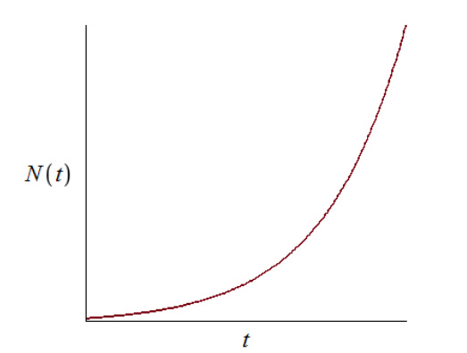

---
## Author
author:
  name: Абдуллахи Бахара
  email: 1032225714@rudn.ru
  affiliation:
    - name: Российский университет дружбы народов
      country: Российская Федерация
      postal-code: 117198
      city: Москва
      address: ул. Миклухо-Маклая, д. 6

## Title
title: "Математическое моделирование"
subtitle: "Лабораторная работа № 7"
license: "CC BY"
---

# Цель работы

Рассмотреть математическую модель эффективности рекламной кампании и исследовать динамику распространения информации о товаре среди потенциальных покупателей.

# Задание

1. Изучить модель эффективности рекламы.
2. Построить графики распространения рекламы для заданных случаев.
3. Для второго случая определить момент времени, когда скорость распространения рекламы достигает максимума.

# Выполнение лабораторной работы

## Теоретические сведения

# Выполнение лабораторной работы

## Теоретические сведения

Пусть проводится рекламная кампания для нового товара или услуги. При ее планировании важно, чтобы будущая прибыль от продаж покрыла расходы на продвижение. На начальном этапе затраты на рекламу могут превышать доход, поскольку о продукте знает лишь небольшая часть потенциальных покупателей. По мере роста информированности увеличивается число продаж, а вместе с ним растет и прибыль. Затем рынок постепенно насыщается, после чего дальнейшая реклама теряет практический смысл.

Предположим, что торговые организации реализуют некоторую продукцию. В момент времени $t$ из общего числа потенциальных покупателей $N$ о товаре знает $n$ человек. Для ускорения продаж запускается реклама через радио, телевидение и прочие средства массовой информации. После начала рекламной кампании сведения о продукции распространяются не только через официальные объявления, но и за счет общения покупателей между собой. Поэтому скорость изменения числа информированных людей зависит от количества уже осведомленных покупателей и от числа тех, кто пока не знает о товаре.

Модель рекламной кампании задается следующими величинами:

- $\frac{dn}{dt}$ — скорость изменения числа потребителей, которые узнали о товаре и готовы его приобрести;
- $t$ — время, прошедшее с момента запуска рекламной кампании;
- $N$ — общее количество потенциальных платежеспособных покупателей;
- $n(t)$ — число уже информированных клиентов.

Влияние прямой рекламы пропорционально числу покупателей, еще не знающих о продукции. Этот вклад записывается в виде:

$$
\alpha_1(t)(N - n(t)),
$$

где $\alpha_1 > 0$ характеризует интенсивность рекламной кампании и зависит от текущих затрат на продвижение.

Кроме прямой рекламы действует распространение информации через уже осведомленных покупателей. Данный механизм связан с так называемым «сарафанным радио». Его вклад описывается выражением:

$$
\alpha_2(t)n(t)(N - n(t)).
$$

Чем больше людей уже знает о товаре, тем сильнее становится данный механизм распространения информации.

Итоговая математическая модель распространения рекламы имеет вид:

$$
\frac{dn}{dt} = (\alpha_1(t) + \alpha_2(t)n(t))(N - n(t)).
$$

Если выполняется условие $\alpha_1(t) >> \alpha_2(t)$, модель становится близкой к модели Мальтуса. Ее решение имеет следующий характер:

{ #fig:001 width=70% height=70% }

При противоположном соотношении $\alpha_1(t) << \alpha_2(t)$ уравнение приводит к логистическому типу роста:

{ #fig:002 width=70% height=70% }

## Задача

Необходимо построить графики распространения рекламы для моделей, заданных уравнениями:

1. $$
   \frac{dn}{dt} = (0.54 + 0.00016n(t))(N - n(t))
   $$

2. $$
   \frac{dn}{dt} = (0.000021 + 0.38n(t))(N - n(t))
   $$

3. $$
   \frac{dn}{dt} = (0.2\cos{t} + 0.2\cos{2t}n(t))(N - n(t))
   $$

Объем потенциальной аудитории равен:

$$
N = 609.
$$

В начальный момент времени о товаре знают:

$$
n(0) = 4
$$

человека.

Для второй модели требуется определить момент времени, в который скорость распространения рекламы принимает наибольшее значение.

Для численного моделирования и построения графиков использовались внешние файлы с программным кодом:





## Базовые эксперименты

### Первая модель (model_type = case1)

В первой модели функция $n(t)$ возрастает монотонно. В начале процесса число информированных покупателей мало по сравнению с верхним пределом $N = 609$, поэтому прирост происходит достаточно интенсивно. Затем, по мере приближения к уровню насыщения, рост постепенно замедляется.

На графике зависимости $n(t)$ видно, что к завершению расчетного интервала $t \in [0; 10]$ решение практически достигает значения $N$. Горизонтальная пунктирная линия показывает предельный уровень, к которому стремится численное решение. Функция $n(t)$ не выходит за эту границу, а плавно приближается к ней снизу.

График производной показывает, что максимальная скорость распространения рекламы возникает в начальный момент времени. Затем величина $\frac{dn}{dt}$ убывает и стремится к нулю. Следовательно, основной прирост числа информированных покупателей приходится на начало процесса, после чего система постепенно выходит на насыщение.

Фазовая траектория $\frac{dn}{dt}(n)$ подтверждает этот вывод. При малых значениях $n$ скорость изменения максимальна, а при приближении к $N$ она почти обращается в ноль. Кривая имеет убывающий характер, поэтому модель описывает быстрый начальный рост с дальнейшим замедлением.

Первая модель демонстрирует устойчивое движение к предельному уровню $N$. Состояние $n = N$ является равновесным, поскольку при насыщении множитель $(N - n)$ обращает правую часть дифференциального уравнения в ноль.

### Вторая модель (model_type = case2)

Во второй модели значение $n(t)$ увеличивается намного быстрее, чем в первой. Расчетный интервал здесь очень короткий: $t \in [0; 0{,}04]$, но даже за это время решение почти достигает уровня $N = 609$. Причина состоит в большом значении коэффициента $b$, усиливающего нелинейное слагаемое $bn$.

График $n(t)$ имеет выраженную S-образную форму. В начале рост идет сравнительно медленно, поскольку информированных покупателей еще мало. Далее скорость резко увеличивается, после чего уменьшается при приближении к уровню насыщения. В результате система быстро выходит к предельному значению.

График $\frac{dn}{dt}$ содержит один отчетливый максимум. Сначала скорость возрастает, затем достигает пикового значения в активной фазе процесса, после чего убывает почти до нуля. Это показывает режим ускоренного роста с последующим торможением за счет ограничивающего множителя $(N - n)$.

Фазовая траектория $\frac{dn}{dt}(n)$ напоминает параболу. При малом $n$ скорость изменения невелика. Затем она растет и достигает максимума примерно при $n \approx 300$, после чего начинает снижаться при движении к $N$. Данная форма отражает взаимодействие двух факторов: самоускорения через множитель $bn$ и ограничения через множитель $(N - n)$.

Вторая модель описывает резкий переход к насыщению. В отличие от первой модели, максимальная скорость достигается не в начале, а внутри траектории, когда число информированных покупателей уже достаточно велико, но запас до уровня $N$ еще остается существенным.

### Третья модель (model_type = case3)

В третьей модели функция $n(t)$ также монотонно возрастает и быстро приближается к уровню $N = 609$. На графике видно, что основная часть роста приходится на начальный участок интервала $t \in [0; 0{,}15]$. После этого кривая почти совпадает с горизонтальным уровнем насыщения.

Особенность третьей модели заключается в использовании периодических коэффициентов $\cos(t)$ и $\cos(2t)$. На выбранном коротком интервале времени эти функции остаются положительными и близкими к единице. Поэтому они не вызывают колебаний решения, а лишь изменяют интенсивность роста.

График скорости $\frac{dn}{dt}$ имеет один выраженный пик. В начале процесса скорость увеличивается, затем достигает максимума, после чего быстро стремится к нулю. После выхода $n(t)$ на уровень насыщения дальнейшее изменение практически прекращается.

Фазовая траектория $\frac{dn}{dt}(n)$ по форме близка к параболической. При малых значениях $n$ скорость невелика, затем она возрастает и достигает максимума примерно в средней части диапазона. При приближении к $N$ множитель $(N - n)$ уменьшает скорость до нуля.

Третья модель показывает насыщаемый рост с коэффициентами, зависящими от времени. На рассматриваемом интервале периодические множители не меняют общий характер процесса: решение остается монотонным, достигает предельного уровня и переходит к равновесному состоянию.

## Сравнение базовых экспериментов

Во всех трех моделях величина $n(t)$ стремится к одному предельному уровню $N = 609$. Это связано с наличием множителя $(N - n)$, который уменьшает скорость роста при приближении к насыщению и обращает ее в ноль при $n = N$.

Первая модель характеризуется быстрым стартом и последующим плавным замедлением. Максимальная скорость наблюдается в начальный момент, а фазовая траектория имеет убывающий вид.

Вторая модель демонстрирует самый резкий S-образный рост. Скорость сначала увеличивается, затем достигает максимума и после этого убывает. Фазовая траектория имеет выраженную параболическую форму, что указывает на наличие внутренней точки максимального роста.

Третья модель по поведению близка ко второй, но отличается зависимостью коэффициентов от времени. На выбранном интервале временная зависимость не приводит к колебательному режиму, поскольку значения $\cos(t)$ и $\cos(2t)$ остаются положительными.

Все три модели приводят систему к насыщению, однако скорость перехода к предельному уровню и характер изменения производной $\frac{dn}{dt}$ различаются.

## Параметрическое сканирование

### Зависимость итогового значения $n$ от параметра $a$

На графике показана зависимость итогового значения $n_{final}$ от параметра $a$ для трех моделей. Основная часть точек расположена вблизи уровня $N = 609$, что говорит о почти полном насыщении к концу расчетного интервала.

Для первой модели значения $n_{final}$ остаются близкими к $N$ при всех рассмотренных значениях параметра $a$. Следовательно, изменение $a$ в выбранном диапазоне не нарушает общий характер процесса: решение продолжает стремиться к предельному уровню.

Во второй модели заметен один выраженный выброс при малом значении $a$. В этом эксперименте итоговое значение $n$ существенно ниже $N$ и составляет примерно $n_{final} \approx 455$. Это связано с тем, что при выбранной комбинации параметров процесс не успевает достичь насыщения за короткий временной интервал.

Для третьей модели значения $n_{final}$ также находятся в верхней части графика и близки к $N$. Периодические коэффициенты при выбранных параметрах не вызывают заметного снижения итогового уровня.

В целом параметр $a$ влияет не только на конечное значение, но и на скорость выхода к насыщению. При малой интенсивности роста система может не успеть приблизиться к уровню $N$ за заданное время моделирования.

### Зависимость итогового значения $n$ от параметра $b$

График зависимости $n_{final}$ от параметра $b$ показывает, что в большинстве экспериментов итоговое значение также расположено около $N = 609$. Это подтверждает устойчивое стремление решений к насыщению.

Для первой модели точки сгруппированы около малых значений $b$, поскольку при сканировании для этой модели использовались небольшие значения коэффициента. Несмотря на это, итоговые значения $n$ остаются близкими к предельному уровню.

Во второй модели влияние параметра $b$ выражено сильнее. При одном из значений $b$ итоговое значение $n$ оказывается заметно ниже уровня насыщения. Это означает, что для данной комбинации параметров рост недостаточно быстр, и система не успевает приблизиться к $N$ за расчетное время.

Для третьей модели точки находятся около $N$, что указывает на сохранение режима насыщаемого роста. Даже при наличии множителей $\cos(t)$ и $\cos(2t)$ итоговое значение остается близким к верхнему пределу.

График показывает, что параметр $b$ особенно важен для моделей с нелинейным усилением роста через слагаемое $bn$. При недостаточном значении этого коэффициента выход на насыщение замедляется.

### Зависимость максимального значения $n$ от параметра $a$

На графике представлена зависимость максимального значения $n_{max}$ от параметра $a$. Поскольку во всех базовых экспериментах функция $n(t)$ возрастает монотонно, величина $n_{max}$ практически совпадает с итоговым значением $n_{final}$.

Для первой модели максимальные значения находятся около уровня $N = 609$. Это означает, что решение достигает верхней границы или подходит к ней очень близко.

Во второй модели снова выделяется точка с меньшим значением $n_{max}$. На всем временном интервале решение не смогло приблизиться к насыщению. Причина связана не с изменением направления динамики, а с недостаточной скоростью роста при выбранной длине расчетного интервала.

Для третьей модели максимальные значения сохраняются около $N$. Следовательно, переменные во времени коэффициенты не препятствуют достижению высокого уровня $n$ при выбранном диапазоне параметров.

Поскольку $n_{max}$ отражает наибольшее значение решения за время расчета, данный график подтверждает выводы, полученные при анализе $n_{final}$.

### Зависимость максимального значения $n$ от параметра $b$

График зависимости $n_{max}$ от параметра $b$ по структуре близок к графику $n_{final}(b)$. Это связано с монотонным ростом решений: максимум достигается в конце расчетного интервала или рядом с ним.

Для первой модели значения $n_{max}$ сосредоточены около $N$. Изменение параметра $b$ в небольшом диапазоне не приводит к существенному снижению максимального уровня.

Во второй модели одна точка располагается значительно ниже остальных. Это показывает, что при соответствующей комбинации параметров модель не выходит на насыщение. Остальные эксперименты для второй модели дают значения около верхнего предела.

Для третьей модели все точки остаются вблизи $N$, что говорит о стабильном достижении насыщения. Параметр $b$ влияет на скорость роста, но в выбранных экспериментах не меняет конечный характер динамики.

График подтверждает, что максимальный уровень $n$ ограничен величиной $N$, а параметры $a$ и $b$ определяют скорость приближения к этому пределу.

### Зависимость финального насыщения от параметра $a$

На графике показана зависимость относительного итогового насыщения $\frac{n_{final}}{N}$ от параметра $a$. Значение, близкое к $1$, соответствует почти полному достижению предельного уровня $N$.

Для первой модели насыщение находится около $1$ при всех рассмотренных значениях $a$. Это показывает, что модель стабильно достигает предельного состояния.

Во второй модели наблюдается одна точка с насыщением около $0{,}75$. В этом эксперименте итоговое значение составляет примерно три четверти от возможного максимума. Остальные точки расположены значительно выше и находятся рядом с полным насыщением.

Для третьей модели значения $\frac{n_{final}}{N}$ находятся вблизи $1$. Это указывает на почти полное насыщение даже при наличии временной зависимости коэффициентов.

Данный график удобен для сравнения моделей, поскольку нормировка на $N$ позволяет оценивать не абсолютное значение $n$, а степень приближения к верхнему пределу.

### Зависимость финального насыщения от параметра $b$

График зависимости $\frac{n_{final}}{N}$ от параметра $b$ показывает, что большинство экспериментов завершается почти полным насыщением. Значения расположены вблизи $1$, что соответствует достижению уровня $N$.

Для первой модели насыщение остается высоким при всех рассмотренных значениях $b$. Даже малые значения параметра не мешают решению приблизиться к предельному уровню за выбранное время.

Во второй модели снова появляется одно пониженное значение. В этом эксперименте система достигает только около $75\%$ от уровня $N$. Результат показывает чувствительность второй модели к сочетанию параметров и длине расчетного интервала.

Для третьей модели точки располагаются рядом с полным насыщением. Временные множители не создают заметного снижения итогового уровня.

В целом график подтверждает стремление системы к насыщению. Однако при отдельных наборах параметров выбранного времени моделирования может оказаться недостаточно для выхода на уровень $N$.

## Бенчмаркинг

### Зависимость времени решения ODE от параметра $a$

На графике показано медианное время численного решения задачи ОДУ при различных значениях параметра $a$. Время вычислений находится примерно в диапазоне от $3{,}45 \cdot 10^{-5}$ до $3{,}95 \cdot 10^{-5}$ секунды.

Для всех трех моделей значения времени близки друг к другу. Это говорит о малой вычислительной сложности рассматриваемых задач. Изменение параметров не приводит к резкому увеличению затрат на интегрирование.

Явной монотонной зависимости времени решения от параметра $a$ не наблюдается. Точки имеют небольшой разброс, который может быть связан с особенностями работы численного метода, кэшированием, системной нагрузкой и погрешностью измерений при очень малых временах выполнения.

Третья модель в некоторых точках показывает немного большее время решения. Возможная причина состоит в более сложной правой части уравнения, где дополнительно вычисляются функции $\cos(t)$ и $\cos(2t)$.

В целом бенчмаркинг показывает, что все три модели решаются быстро, а различия между ними по времени вычислений остаются небольшими.

### Зависимость времени решения ODE от параметра $b$

На графике представлена зависимость времени решения ОДУ от параметра $b$. Как и для параметра $a$, значения времени находятся в узком диапазоне порядка $10^{-5}$ секунды.

Для первой модели точки сосредоточены около малых значений $b$, что соответствует выбранной сетке параметров. Время решения немного колеблется, но не демонстрирует устойчивого роста или убывания.

Для второй модели значения времени также изменяются с небольшим разбросом. Даже при увеличении $b$ вычислительные затраты не возрастают существенно. Это показывает, что выбранный численный решатель справляется с задачей без заметного усложнения интегрирования.

Для третьей модели часть точек расположена выше, чем у первых двух моделей. Вероятная причина связана с более сложной формулой правой части, содержащей тригонометрические множители. При этом различие остается небольшим и не меняет общий вывод о высокой скорости расчета.

График показывает, что параметр $b$ сильнее влияет на динамику решения, чем на время вычислений. В рамках проведенного сканирования вычислительная стоимость остается стабильной для всех трех моделей.

## Выводы

1. Первая модель (case1) описывает насыщаемый рост функции $n(t)$. Решение монотонно увеличивается и постепенно приближается к предельному уровню $N = 609$, не превышая его.

2. Во второй модели (case2) наблюдается наиболее резкий рост. Функция $n(t)$ имеет выраженную S-образную форму: сначала рост идет медленно, затем ускоряется, после чего замедляется при приближении к насыщению.

3. Третья модель (case3) также приводит систему к насыщению, но отличается переменными во времени коэффициентами $\cos(t)$ и $\cos(2t)$. На выбранном интервале они не вызывают колебаний, поэтому решение остается монотонным.

4. Во всех трех моделях значение $N$ играет роль уровня насыщения. При приближении $n(t)$ к $N$ множитель $(N - n)$ снижает скорость роста, а при $n = N$ правая часть уравнения становится равной нулю.

5. Графики скорости изменения $\frac{dn}{dt}$ показывают различия между моделями. В первой модели скорость максимальна в начальный момент и затем монотонно убывает. Во второй и третьей моделях скорость сначала возрастает, достигает максимума, а затем снижается почти до нуля.

6. Фазовые траектории $\frac{dn}{dt}(n)$ подтверждают характер динамики. Для первой модели траектория имеет убывающий вид, а для второй и третьей моделей — форму, близкую к параболической, с внутренней точкой максимальной скорости роста.

7. Параметры $a$ и $b$ в первую очередь влияют на скорость выхода к насыщению. При достаточно больших значениях параметров система быстро достигает уровня $N$, а при отдельных комбинациях, особенно во второй модели, решение не успевает полностью выйти на насыщение за заданное время.

8. Метрики $n_{final}$ и $n_{max}$ в большинстве экспериментов близки к $N = 609$, что указывает на достижение предельного состояния. Заметные отклонения связаны не с изменением направления динамики, а с недостаточной длительностью расчетного интервала для некоторых наборов параметров.

9. Метрика $\text{saturation\_final} = \frac{n_{final}}{N}$ позволяет оценить степень достижения насыщения. Значения, близкие к единице, соответствуют почти полному выходу системы на предельный уровень, а пониженные значения указывают на незавершенный переходный процесс.

10. Бенчмаркинг показал, что численное решение всех трех моделей выполняется быстро. Время вычислений имеет порядок $10^{-5}$ секунды, а изменение параметров $a$ и $b$ почти не влияет на вычислительные затраты.

11. Третья модель немного сложнее с вычислительной точки зрения, поскольку правая часть содержит тригонометрические функции. Однако разница во времени решения остается небольшой и не оказывает существенного влияния на общую эффективность расчетов.

12. Все три модели описывают процесс насыщаемого роста, но отличаются скоростью перехода к предельному состоянию и формой зависимости $\frac{dn}{dt}$ от времени и значения $n$.

# Список литературы {.unnumbered}

1. [Модель Мальтуса](http://km.mmf.bsu.by/courses/2018/mathmod1/MM_LB1_Population_2019.pdf)
2. [Логистическая модель роста](https://studopedia.ru/29_5129_logisticheskaya-model-rosta.html)
